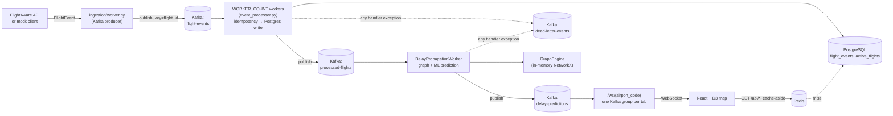

# Flight Tracker

A real-time flight delay tracking and propagation system: it ingests flight events, predicts and propagates delays through a graph of shared aircraft and gates, and streams the result to a live map over WebSocket.

[](https://github.com/anirudhp-ops/Flight_Tracker/actions/workflows/test.yml)

> **Status: functional prototype**, not production-hardened. It runs end to end against real infrastructure (Postgres, Redis, Kafka) with real load-tested numbers — see [Performance](#performance) — but has known scaling limits and no live deployment yet. See [Project status](#project-status).

## Contents

- [Architecture](#architecture)
- [Quick start](#quick-start)
- [Features](#features)
- [Tech stack](#tech-stack)
- [Project structure](#project-structure)
- [Running locally](#running-locally)
- [Running on AWS](#running-on-aws)
- [Testing](#testing)
- [Performance](#performance)
- [Documentation](#documentation)
- [Contributing](#contributing)
- [License](#license)

## Architecture



One end-to-end path through the system: a delayed flight's event lands on `flight-events` → a worker persists it to Postgres and forwards it → `DelayPropagationWorker` walks the in-memory graph (BFS from the delayed flight, along shared-aircraft and shared-gate edges), predicts delay for it with a trained model, and republishes every affected flight → every connected browser tab receives the update over its own WebSocket connection and the map updates live, no polling.

Full component breakdown, design rationale, and the exact event flow: **[docs/ARCHITECTURE.md](docs/ARCHITECTURE.md)**.

## Quick start

Requires [Docker](https://docs.docker.com/get-docker/) (with Compose) and, once, a trained ML model (`ml/model.pkl` is gitignored — it's ~955MB and not something you want baked into an image or a git history):

```bash
git clone git@github.com:anirudhp-ops/Flight_Tracker.git
cd Flight_Tracker
python3 -m venv .venv && source .venv/bin/activate && pip install -r requirements.txt
python ml/train.py ml/fixtures/ci_sample_ontime.csv   # trains a real model from the small checked-in sample; see ml/train.py for using the full dataset instead

docker compose up -d
```

Open **http://localhost:3000** — you should see mock flights moving on the map within a few seconds (`ENABLE_FLIGHTAWARE_API=false` by default: no real API key needed, no paid calls possible). Confirm the whole stack is actually healthy:

```bash
curl http://localhost:8000/health
./scripts/smoke-tests.sh
```

That's it — Postgres, Redis, Kafka, the FastAPI backend, and the React frontend are all running in containers. See [Running locally](#running-locally) for the non-Docker, hot-reload development setup, and [docs/DEPLOYMENT.md](docs/DEPLOYMENT.md) for everything above in more detail.

## Features

- Live flights on an interactive D3 world map, streamed over WebSocket with automatic reconnect — no polling, no page refresh.
- A dependency graph (NetworkX) linking flights that share an aircraft (`aircraft_turn`) or a gate with an overlapping time window (`gate_reuse`).
- Delay propagation: a BFS walk from a delayed flight through that graph, decaying 25% per hop, so a single delay's downstream impact shows up on the map automatically.
- Gate conflict resolution: when two overlapping flights would share a gate, one is reassigned from a configurable per-airport gate pool.
- A trained `RandomForestRegressor` predicts arrival delay per flight, using the flight's own schedule to estimate air time/distance when the source doesn't supply them.
- Kafka-backed pipeline with at-least-once delivery, manual offset commits, a dead-letter queue for failed messages, and verified crash-recovery (see [docs/ARCHITECTURE.md](docs/ARCHITECTURE.md#event-flow)).
- Cache-aside Redis layer in front of the read-heavy GET endpoints, with per-endpoint TTLs sized to how fast each thing actually changes.
- Prometheus metrics + a provisioned Grafana dashboard + structured JSON logging with request-id tracing across the whole pipeline.
- A cost-protection switch (`ENABLE_FLIGHTAWARE_API`) that keeps live, paid FlightAware API calls off unless explicitly and deliberately turned on.

## Tech stack

| Layer | Technology |
|---|---|
| Backend | Python 3.13, FastAPI, uvicorn |
| Event streaming | Apache Kafka 4.x (KRaft, no Zookeeper), aiokafka |
| Database | PostgreSQL 16, asyncpg |
| Cache | Redis 7 |
| Graph | NetworkX |
| ML | scikit-learn (RandomForestRegressor) |
| Frontend | React 19, D3.js |
| Observability | Prometheus, Grafana, structured JSON logging |
| Containerization | Docker, docker-compose |
| CI | GitHub Actions (pytest + Jest, dependency scanning) |

## Project structure

```
flight_tracker/          Backend application package
├── server.py               FastAPI app: REST endpoints, WebSocket handler, startup/shutdown wiring
├── config.py                Single source of truth for env vars (pydantic-settings)
├── models/                  Pydantic models: FlightEvent, PredictionEvent, ...
├── ingestion/                FlightAware/mock client + the poll-and-publish worker
├── events/                   Kafka producer, envelope/event models, DLQ utilities
├── workers/                  Concurrent worker pool, delay propagation worker, retry, supervision
├── graph/                    GraphEngine: aircraft-turn/gate-reuse edges, BFS propagation, gate conflicts
├── db/                       asyncpg pool, schema, reader/writer queries
├── cache/                    Redis cache-aside layer
├── websocket/                Typed WebSocket message envelope
├── metrics/                  Prometheus metric definitions
├── observability/            Grafana dashboard JSON
├── middleware/                Request-ID middleware
└── tests/                    pytest suite (154 tests)

ml/                       Delay prediction model: train.py, predictor.py, model.pkl (gitignored)
frontend/                 React + D3 app (create-react-app)
scripts/                  Load tests, benchmarks, integration tests, smoke tests, Kafka topic setup
docs/                     This documentation set
grafana/, prometheus.yml, alert_rules.yml   Observability stack config
docker-compose.yml, Dockerfile, frontend/Dockerfile   Containerization
.github/workflows/        CI: test suite + daily dependency scan
```

Every subpackage under `flight_tracker/` that has non-obvious design decisions has its own `*.md` alongside the code (e.g. `flight_tracker/workers/CONCURRENCY.md`, `flight_tracker/graph/STATE_MANAGEMENT.md`) — [docs/ARCHITECTURE.md](docs/ARCHITECTURE.md) links to all of them from the component that owns each one.

## Running locally

Two ways to run this, both real, pick whichever fits what you're doing:

**Docker (everything, no hot reload)** — see [Quick start](#quick-start) above.

**Host processes (hot reload, for active backend/frontend development)**:

```bash
# Postgres, Redis, Kafka — native installs, or just the infra services from compose:
docker compose up -d postgres redis kafka
cp .env.example .env   # edit if your local Postgres/Redis/Kafka aren't on the defaults
createdb flight_tracker

source .venv/bin/activate
uvicorn flight_tracker.server:app --reload

cd frontend && npm install && npm start
```

Open http://localhost:3000. Full details, prerequisites, and troubleshooting: **[docs/DEPLOYMENT.md](docs/DEPLOYMENT.md)** and **[docs/TROUBLESHOOTING.md](docs/TROUBLESHOOTING.md)**.

## Running on AWS

**Not deployed anywhere yet.** There's no Terraform, no CloudFormation, no live AWS environment for this project today — the `Dockerfile`/`frontend/Dockerfile`/`docker-compose.yml` in this repo make it deployable, but "deployable" and "deployed" aren't the same thing yet. What exists and what's still a decision: **[docs/DEPLOYMENT.md § AWS](docs/DEPLOYMENT.md#aws-not-yet-deployed)**.

## Testing

```bash
pytest flight_tracker/tests/ -v                              # backend: 154 tests
cd frontend && npm test -- --watchAll=false --coverage        # frontend: 28 tests
python scripts/integration_tests.py                           # real pipeline, real Kafka/Postgres
./scripts/smoke-tests.sh                                      # health + API + WebSocket, post-deploy
```

CI (`.github/workflows/test.yml`) runs the backend and frontend suites, with a real Postgres/Redis/Kafka, on every PR and push to `main`. Coverage gates: 70% backend (91% excluding the two files that are integration-tested instead — see [docs/DEVELOPMENT.md](docs/DEVELOPMENT.md#testing)), 70%/70%/70%/60% frontend (statements/lines/functions/branches).

Full testing layers (unit → integration → load → benchmark), what each one checks, and how to run it: **[docs/DEVELOPMENT.md](docs/DEVELOPMENT.md)** and `flight_tracker/TESTING.md`.

## Performance

Real numbers from load-testing the actual stack, not estimates (`flight_tracker/LOAD_TEST_REPORT.md`):

| | Result |
|---|---|
| Sustained throughput, end-to-end | ~25 events/sec at low latency; **does not** sustain 100 events/sec (p99 climbs to ~11s — see [docs/PERFORMANCE.md](docs/PERFORMANCE.md)) |
| Cascade propagation (50 simultaneous, 100 affected flights) | 0.145–1.011s (target: <5s) |
| WebSocket spike (0→100 concurrent connections) | 0% errors, 100% connect success |
| Cache speedup (Redis vs. Postgres) | 93.5% |
| ML prediction latency (p95) | 18.4ms (target was <10ms — **missed**, reported honestly) |

Both known limitations above are explained, reproduced, and have documented remediation options — not hidden. Full report: **[docs/BENCHMARKS.md](docs/BENCHMARKS.md)** and **[docs/PERFORMANCE.md](docs/PERFORMANCE.md)**.

## Documentation

| Doc | Covers |
|---|---|
| [docs/ARCHITECTURE.md](docs/ARCHITECTURE.md) | System components, event flow, design decisions (why Kafka, why NetworkX, why the graph is ephemeral) |
| [docs/API.md](docs/API.md) | Every REST endpoint and the WebSocket protocol, with real example payloads |
| [docs/DATA_MODEL.md](docs/DATA_MODEL.md) | Database schema, Pydantic models, event types, Kafka topics/partitioning |
| [docs/DEPLOYMENT.md](docs/DEPLOYMENT.md) | Docker Compose, environment variables, monitoring, AWS roadmap |
| [docs/DEVELOPMENT.md](docs/DEVELOPMENT.md) | Adding a feature, running/debugging/profiling, commit conventions |
| [docs/PERFORMANCE.md](docs/PERFORMANCE.md) | Bottleneck analysis and optimization recommendations |
| [docs/BENCHMARKS.md](docs/BENCHMARKS.md) | Full load test and benchmark result tables |
| [docs/TROUBLESHOOTING.md](docs/TROUBLESHOOTING.md) | Common issues and how to diagnose them |
| [docs/QUICK_REFERENCE.md](docs/QUICK_REFERENCE.md) | Command cheat sheet |
| [flight_tracker/OBSERVABILITY.md](flight_tracker/OBSERVABILITY.md) | Metrics, Grafana dashboard, structured logging |
| [CHANGELOG.md](CHANGELOG.md) | What was built in each phase |

Every subdirectory under `flight_tracker/` also has its own design-decision doc (linked from docs/ARCHITECTURE.md) — this project documents *why*, not just what, throughout.

## Project status

Real, tested capabilities and real, documented gaps — from `flight_tracker/LOAD_TEST_REPORT.md` and this codebase's own module docs:

- End-to-end pipeline (ingest → persist → propagate → predict → stream) works and is integration- and load-tested against real infrastructure.
- Sustains ~25 events/sec end-to-end; does not sustain 100 events/sec — the single-instance `DelayPropagationWorker` is the bottleneck (in-memory graph state, not horizontally scaled — see [docs/PERFORMANCE.md](docs/PERFORMANCE.md)).
- `flight_events` has no retention/archival policy yet — it grows unbounded (visible on every cleanup pass; not silently hidden).
- No live deployment, no authentication, no rate limiting — this is a local/prototype system today, not one exposed to untrusted traffic.
- `GraphEngine` state is intentionally ephemeral (rebuilt from Postgres on every restart) — see `flight_tracker/graph/STATE_MANAGEMENT.md` for why that's a decision, not a gap.

## Contributing

Bug reports, feature ideas, and PRs are welcome. See **[CONTRIBUTING.md](CONTRIBUTING.md)** for the process, code style, and testing requirements.

## License

MIT — see [LICENSE](LICENSE).
