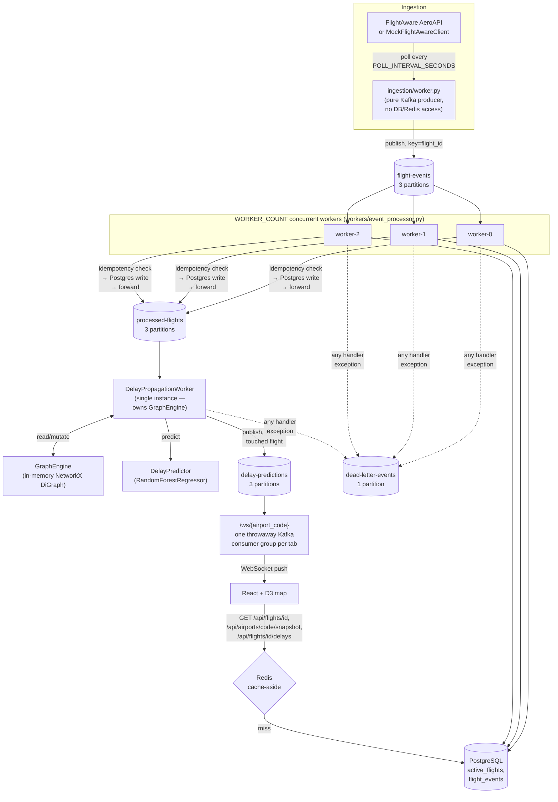

# Architecture

This is the synthesis document — it explains how the pieces fit together and links to each subsystem's own design-decision doc for depth. Where this file and a linked doc disagree on a detail, the linked doc (closer to the code) wins; this file is kept high-level on purpose.

> **A note on staleness**: `flight_tracker/events/KAFKA_ARCHITECTURE.md`'s consumer-group/partition/offset reasoning is still accurate, but its original pipeline diagram described Phase D's two single-instance consumers (`ingestion/consumer_runner.py`, `events/delay_prediction_consumer.py`). Phase E/F replaced both with the worker pool and `DelayPropagationWorker` described below — the old files are kept in the repo as a worked "simple single-consumer" reference (see `flight_tracker/workers/CONCURRENCY.md`) but are **not started** by `server.py`. This document, `CONCURRENCY.md`, and `STATE_MANAGEMENT.md` reflect the current (Phase F+) architecture.

## System diagram

## Components

### FastAPI backend (`flight_tracker/server.py`)

One process, one `FastAPI` app. On startup: creates the shared asyncpg pool, ensures the DB schema exists, rebuilds `GraphEngine` from Postgres, starts the Kafka producer, the ingestion worker task, the `WORKER_COUNT`-worker pool (via `Supervisor`), and the single-instance `DelayPropagationWorker` (also via `Supervisor`). Serves REST endpoints (cache-aside reads, health checks, Prometheus metrics) and the `/ws/{airport_code}` WebSocket. See **[docs/API.md](API.md)** for every endpoint.

### Kafka topics and consumers

Four topics, all 3-partitioned except the DLQ (1 partition, low expected volume): `flight-events` → `processed-flights` → `delay-predictions`, plus `dead-letter-events` as the catch-all failure sink. Partitioned and keyed by `flight_id`, so one flight's events are always ordered relative to each other (no cross-flight ordering guarantee, and none is needed). Full reasoning — partition counts, consumer group strategy, offset management, failure/recovery scenarios, and Kafka-vs-Redis-pub/sub — in **[flight_tracker/events/KAFKA_ARCHITECTURE.md](../flight_tracker/events/KAFKA_ARCHITECTURE.md)** (see the staleness note above for which parts still apply verbatim).

### Async workers (`flight_tracker/workers/`)

Two independent, separately-supervised pipelines, both consuming descendants of `flight-events`:

- **The persistence pool** (`event_processor.py`, `worker_pool.py`): `WORKER_COUNT` (default 4) concurrent `asyncio` tasks, each running idempotency-check → Postgres write → forward-to-`processed-flights` for events on its assigned partition(s). Stateless per message — safe to run more than one process of, up to the 3-partition ceiling.
- **`DelayPropagationWorker`** (`delay_propagation_worker.py`): single instance, deliberately not scaled out, because it's the only thing that owns `GraphEngine` — in-memory, in-process state that can't be safely sharded across workers without a redesign (see `STATE_MANAGEMENT.md`). Runs graph mutation → BFS delay propagation → gate-conflict resolution → ML prediction → publish, per event.

Both are wrapped by `Supervisor` (crash → log → wait 5s → restart just that worker) and use the same jittered exponential backoff (`retry.py`) for transient DB/Kafka failures. Full concurrency model, locking, backpressure, and scaling guidance: **[flight_tracker/workers/CONCURRENCY.md](../flight_tracker/workers/CONCURRENCY.md)**.

### GraphEngine (`flight_tracker/graph/engine.py`)

An in-memory `networkx.DiGraph` where each node is a flight (keyed by `flight_key`) and edges represent `aircraft_turn` (same physical aircraft) or `gate_reuse` (same gate, overlapping scheduled window) relationships. Three operations matter:

- `propagate_delay()` — BFS from a delayed flight, decaying the propagated delay by 25% per hop and merging (`max()`, never regressing a larger existing delay) into every reachable neighbor.
- `resolve_gate_conflicts()` — for every `gate_reuse` edge whose two flights' windows genuinely overlap, reassigns one to a free gate from the airport's configured pool.
- `prune_expired_flights()` — removes landed flights older than 24h so the graph (and the O(V) cost of `add_edges_for_flight` on every new event) doesn't grow unbounded.

**Deliberately ephemeral**: never persisted, rebuilt from `active_flights` on every process startup. Full reasoning: **[flight_tracker/graph/STATE_MANAGEMENT.md](../flight_tracker/graph/STATE_MANAGEMENT.md)**.

### PostgreSQL + Redis

Postgres holds the two tables described in **[docs/DATA_MODEL.md](DATA_MODEL.md)** — `flight_events` (append-only history) and `active_flights` (current state, upserted with a staleness guard). Redis serves two distinct roles: a cache-aside layer in front of the three read-heavy GET endpoints (`flight_tracker/cache/redis_cache.py`), and a fast-path idempotency check (`processed:{flight_id}:{timestamp}`) ahead of the DB-level `UNIQUE` constraint that's the actual correctness guarantee. Design rationale for both tables and both Redis roles: **[flight_tracker/db/DATABASE_DESIGN.md](../flight_tracker/db/DATABASE_DESIGN.md)**.

### React frontend (`frontend/`)

Create-react-app + D3. `hooks/useFlightData.js` owns the WebSocket connection (with reconnect-with-backoff) and dispatches on `WSMessage.type`; `components/FlightMap.jsx` renders positions/routes/cascade overlays, `FlightDetail.jsx` shows prediction confidence and propagation chains, `GateMap.jsx` shows gate occupancy and reassignment highlights. Fetches `/api/config` once on load (for `target_airport`), then it's WebSocket-only — no polling. See `frontend/REAL_TIME_ARCHITECTURE.md` and `frontend/USER_GUIDE.md`.

### WebSocket pipeline (`flight_tracker/websocket/messages.py`, `server.py`'s `/ws/{airport_code}`)

Every message is a typed `WSMessage` (`SNAPSHOT`, `FLIGHT_UPDATE`, `DELAY_PREDICTION`, `PROPAGATION_EVENT`, `GATE_REASSIGNMENT`, `HEARTBEAT`). On connect: one `SNAPSHOT` (current `GraphEngine` state), then bounded replay of recent messages for late joiners, then the live stream. Each connection gets its own throwaway Kafka consumer group on `delay-predictions` so every open tab sees every event, not a partitioned share of them (see the Kafka doc's "Consumer group strategy"). Full protocol and example payloads: **[docs/API.md](API.md#websocket)**.

## Event flow

The full path from a flight delay to it appearing on the frontend map:

1. A flight event (real or mock) is published to `flight-events`, keyed by `flight_id`.
2. A persistence worker picks it up: checks the Redis idempotency cache, writes to `active_flights`/`flight_events` (upsert with staleness guard / `ON CONFLICT DO NOTHING`), forwards to `processed-flights`.
3. `DelayPropagationWorker` consumes it, calls `GraphEngine.process_event()` (adds/updates the node and its `aircraft_turn`/`gate_reuse` edges).
4. If the event is delayed (`delay_minutes > 0`), `propagate_delay()` BFS-walks the graph from that flight, updating every reachable neighbor's delay (decayed, merged).
5. `resolve_gate_conflicts()` runs, reassigning any flight now in a genuine gate conflict.
6. `DelayPredictor.predict()` runs for the triggering flight (and, implicitly, its `delay_minutes` for propagated neighbors is already set by step 4 — see `classify_prediction_event()`'s docstring for exactly how each touched flight is classified).
7. One `PredictionEvent` per touched flight (the trigger, every propagated neighbor, every gate-reassigned flight) is published to `delay-predictions`.
8. Every connected browser's `/ws/{airport_code}` consumer reads it, `classify_prediction_event()` maps it to a typed `WSMessage`, and it's pushed over that tab's WebSocket.
9. The frontend's `useFlightData` hook dispatches on message type and the map updates — no polling, no page refresh, no round trip through a REST endpoint.

Measured, real numbers for each hop: **[docs/PERFORMANCE.md](PERFORMANCE.md)**.

## Design decisions

**Why Kafka, not Redis pub/sub (which this app used through Phase C)**: pub/sub has no log — a message with no subscriber, or a consumer that crashes mid-message, is simply lost, with no way for a restarted consumer to catch up. Kafka retains messages per-topic and commits offsets only after successful processing, so a `SIGKILL`ed process resumes exactly where it left off on restart — verified live, not just asserted (see the Kafka doc's "Failure scenarios"). The real cost: an extra operational component (the broker itself) for a guarantee Redis pub/sub structurally cannot provide.

**Why NetworkX for the graph, not a graph database**: the graph is small (hundreds to low thousands of nodes at this app's current scale), lives entirely in one process, and needs no persistence (see "ephemeral, by decision" above) or cross-process query language — a real graph DB (Neo4j, etc.) would add an operational dependency and a network hop per graph operation for no benefit this app currently needs. `networkx.DiGraph` gives BFS, edge iteration, and node attributes in-process, in Python, for free.

**Why the graph is ephemeral, not persisted**: Postgres's `active_flights` is already the durable source of truth; the graph is a *derived* view over it (which flights exist, plus the relationships between them). Persisting a second, independently-serialized copy would mean either accepting staleness risk (reloading old propagation/gate state after a long outage) or building real synchronization machinery for a cost measured at under a second even at current scale. Full tradeoff analysis, including the Redis-snapshot alternative that was considered and explicitly not built: **[flight_tracker/graph/STATE_MANAGEMENT.md](../flight_tracker/graph/STATE_MANAGEMENT.md)**.

**Why cache-aside, not write-through, for Redis**: the ingestion/worker write path never invalidates cache keys — a deliberate simplification. Every cached value is wrong for at most its TTL (5–10 minutes, sized per endpoint to how fast that data actually changes), which is a bound the app already needs regardless, versus threading cache-invalidation logic into every write path for a marginal freshness improvement. See `DATABASE_DESIGN.md`'s "Caching strategy and TTLs".

**Why at-least-once delivery, not exactly-once**: exactly-once (Kafka transactions spanning producer → consumer → DB write) is real, load-bearing complexity that buys correctness this app doesn't need — an occasional duplicate delivery of a flight-status event has zero real consequence, and is already absorbed for free by the same staleness-guard upsert Postgres needed anyway. See `flight_tracker/events/IDEMPOTENCY.md` for the full reasoning and what changed between Phase D and Phase E.

**Why a single-instance `DelayPropagationWorker` (the app's known throughput ceiling)**: `GraphEngine` is process-local, in-memory, mutable state. Running two instances would mean two independently-diverging copies of the graph with nothing to reconcile them — a correctness problem, not just a scaling one — so this worker is deliberately not part of the horizontally-scaled pool. The real-world consequence (sustains ~25 events/sec, not 100) is measured and documented, not hidden: **[docs/PERFORMANCE.md](PERFORMANCE.md)**.
