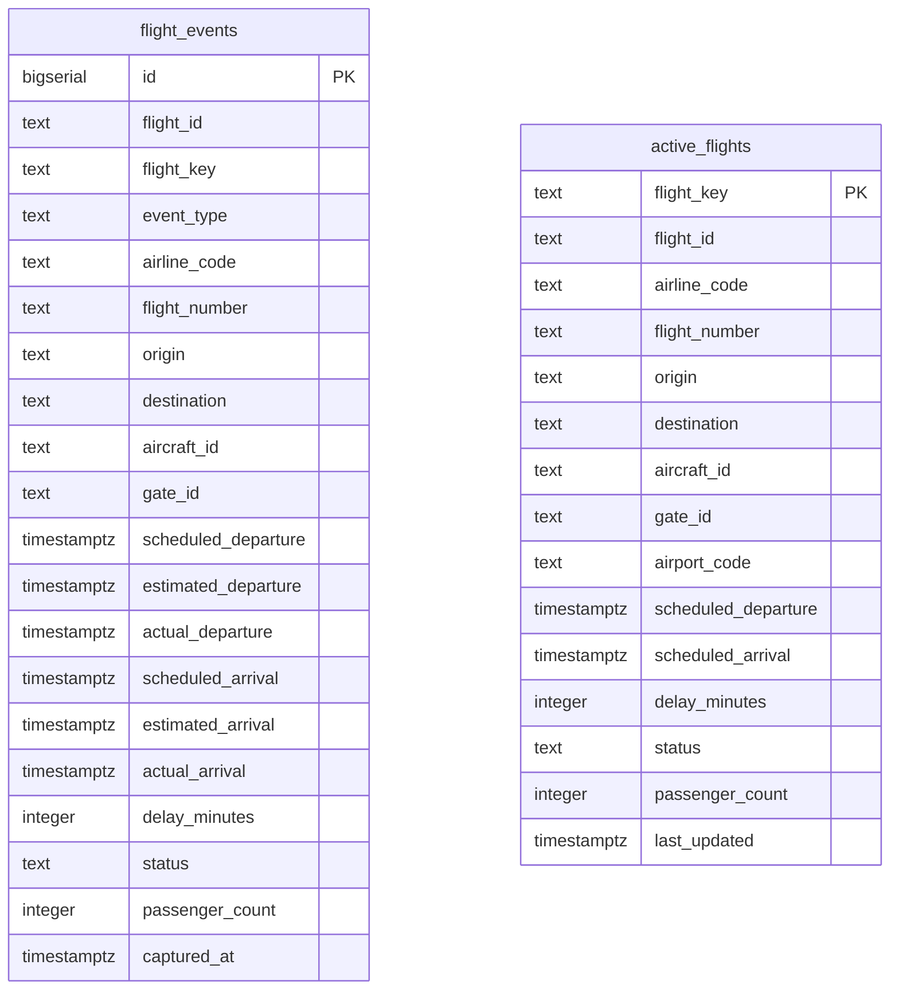

# Data Model

## Database schema

Two tables, deliberately not one or three — see [`flight_tracker/db/DATABASE_DESIGN.md`](../flight_tracker/db/DATABASE_DESIGN.md) for why. Defined in `flight_tracker/db/writer.py`; created via `CREATE TABLE IF NOT EXISTS` on every backend startup (`ensure_schema()`, called from `server.py`'s `startup()` handler) — there is no separate migration step or tool (see [Migrations](DEPLOYMENT.md#database-schema-migrations) in the deployment guide).



There is no foreign key between them — they're linked only by convention (`flight_key = {airline_code}{flight_number}-{date}`, both derived the same way from a `FlightEvent`), not a DB constraint, because they serve different purposes (see below) and nothing in this app ever needs a join between them.

### `flight_events` — append-only history

Every ingestion poll inserts new rows unconditionally. `UNIQUE(flight_id, captured_at)` (`ux_flight_events_flight_id_captured_at`) plus `ON CONFLICT (flight_id, captured_at) DO NOTHING` in `write_events()` makes an exact-duplicate delivery a no-op insert, not a second row — this is a Phase E addition; see [`flight_tracker/events/IDEMPOTENCY.md`](../flight_tracker/events/IDEMPOTENCY.md) for why Phase D deliberately left this table non-deduplicated and what changed. Indexed on `flight_key` (`idx_flight_events_flight_key`) and the unique `(flight_id, captured_at)` pair. No retention policy — this table grows unboundedly today, logged (not hidden) on every cleanup pass; see [docs/PERFORMANCE.md](PERFORMANCE.md).

### `active_flights` — current state, one row per flight

Keyed by `flight_key` (not `flight_id` — see the ID note below). Written with an **upsert-with-staleness-guard**:

```sql
INSERT INTO active_flights (...) VALUES (...)
ON CONFLICT (flight_key) DO UPDATE SET ...
WHERE active_flights.last_updated < EXCLUDED.last_updated
```

This makes a lost update (a slow/out-of-order write clobbering a newer one) structurally impossible, rather than relying on the ingestion worker never delivering out of order. `airport_code` was added in a later migration (`SCHEMA_MIGRATIONS_SQL`, applied unconditionally after `CREATE_TABLES_SQL` on every startup — see the comment in `writer.py` for why `CREATE TABLE IF NOT EXISTS` alone can't add a column to a table that already exists) with a best-effort backfill (`origin`, the closest available approximation for pre-migration rows). Indexed on `(airport_code, last_updated)` for the airport-snapshot query — see `DATABASE_DESIGN.md` for why this index is mostly idle at today's single-airport scale but kept anyway.

**Cleanup**: `active_flights` rows for long-landed flights are deleted outright (not soft-deleted) on a scheduled job, because `flight_events` already *is* the permanent archive — there's nothing to lose. `flight_events` itself has no equivalent cleanup (see above).

### Why `flight_key`, not `flight_id`, is the primary key

`flight_id` (e.g. `UA100-mock-3`) is **not unique across a flight's history** in this schema — it identifies one *tracked instance* of ingestion, not one real-world flight across its whole lifecycle the way `flight_key` (`{airline_code}{flight_number}-{scheduled_departure_date}`) does. `active_flights` needs "what is currently true about flight AA123 today," which is exactly what `flight_key` answers; `flight_id` is carried on both tables for lookups (`GET /api/flights/{flight_id}`) but isn't the identity column.

## Pydantic models

### FlightEvent

Defined in `flight_tracker/models/events.py` — the core domain object — what's ingested, what's stored (minus a few DB-only fields), what flows through Kafka, and what the frontend renders.

| Field | Type | Notes |
|---|---|---|
| `flight_id` | `str` | |
| `event_type` | `EventType` | see below |
| `airline_code`, `flight_number` | `str` | |
| `origin`, `destination` | `str` | airport codes |
| `aircraft_id` | `str \| None` | drives `aircraft_turn` graph edges |
| `gate_id` | `str \| None` | drives `gate_reuse` graph edges |
| `scheduled_departure`, `scheduled_arrival` | `datetime` | required |
| `estimated_departure`, `actual_departure`, `estimated_arrival`, `actual_arrival` | `datetime \| None` | |
| `delay_minutes` | `int` | validated non-negative (`max(0, v)`) |
| `status` | `FlightStatus` | see below |
| `passenger_count` | `int \| None` | |
| `timestamp` | `datetime` | when this event was captured |
| `air_time`, `distance` | `float \| None` | real values when the source provides them; see computed properties below when it doesn't |

Computed properties: `is_delayed` (`delay_minutes > 0`), `flight_key` (derives the DB primary key — `{airline_code}{flight_number}-{scheduled_departure:%Y%m%d}`), `estimated_air_time_minutes` (falls back to scheduled block time), `estimated_distance_miles` (falls back to a ~450mph cruise-speed estimate) — the latter two exist so `DelayPredictor` never sees a literal 0 for a source that doesn't supply real air-time/distance, which would otherwise skew the model.

### `EventType` (enum)

`departure` · `arrival` · `delay` · `gate_change` · `cancellation` · `diversion`

### `FlightStatus` (enum)

`scheduled` · `active` · `landed` · `cancelled` · `diverted`

### `PredictionEvent` (`flight_tracker/models/prediction_event.py`)

Published to `delay-predictions` by `DelayPropagationWorker`, one per flight it touches per processing pass (the trigger, every propagated neighbor, every gate-reassigned flight).

| Field | Type | Notes |
|---|---|---|
| `event_id` | `UUID` | auto-generated |
| `flight_id` | `str` | |
| `flight_event` | `FlightEvent` | full nested object — see the module docstring for why (frontend compatibility; avoids a lookup per WS message) |
| `predicted_delay_minutes` | `int` | |
| `predicted_arrival_time` | `datetime` | |
| `model_confidence` | `float` | `0.0`–`1.0` |
| `propagation_source` | `str \| None` | set only if this prediction resulted from BFS propagation |
| `propagation_hops` | `int \| None` | set only alongside `propagation_source` |
| `gate_reassignment` | `GateReassignmentDetail \| None` | `{old_gate: str \| None, new_gate: str}` — set only if `resolve_gate_conflicts()` moved this flight |
| `schema_version` | `int` | `1` |

### `WSMessage` (`flight_tracker/websocket/messages.py`)

See [docs/API.md](API.md#message-envelope) for the full protocol and example payloads.

## Kafka topics and partitioning

| Topic | Partitions | Retention | Keyed by |
|---|---|---|---|
| `flight-events` | 3 | 7d | `flight_id` |
| `processed-flights` | 3 | 7d | `flight_id` |
| `delay-predictions` | 3 | 7d | `flight_id` |
| `dead-letter-events` | 1 | 30d | (none — round-robin) |

Full partition/consumer-group/offset reasoning, failure scenarios, and the Kafka-vs-Redis-pub/sub comparison: [`flight_tracker/events/KAFKA_ARCHITECTURE.md`](../flight_tracker/events/KAFKA_ARCHITECTURE.md) (see [docs/ARCHITECTURE.md](ARCHITECTURE.md)'s staleness note — the partition/consumer-group content is current, the pipeline diagram in that file describes a superseded architecture).
